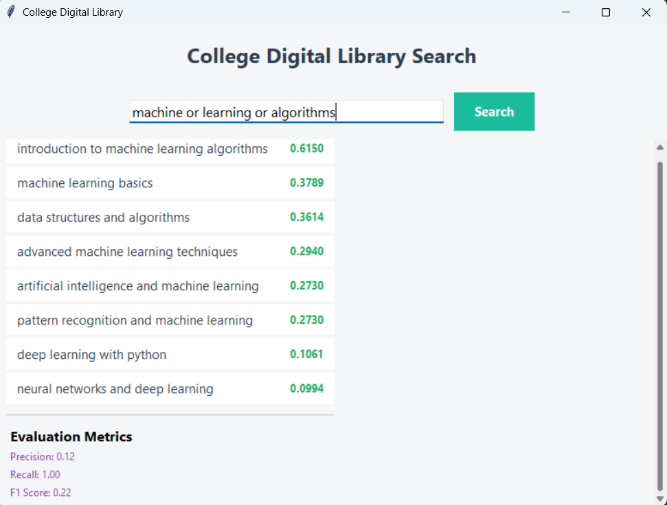

# 📚 College Digital Library Search System


---

## 🔍 Overview

The **College Digital Library Search System** is a Python-based application that enables efficient searching of academic documents using Information Retrieval techniques.

It combines:

* **Boolean Retrieval Model** (AND, OR, NOT)
* **TF-IDF Ranking Algorithm**
* **Evaluation Metrics** (Precision, Recall, F1-score)

A clean and interactive **GUI built with Tkinter** allows users to easily search and view ranked results.

---

## ✨ Features

* 🔍 Keyword-based search
* ⚙️ Boolean operations (AND, OR, NOT)
* 📊 TF-IDF ranking for relevance
* 📈 Evaluation metrics (Precision, Recall, F1 Score)
* 🖥️ User-friendly GUI
* ⚡ Smooth transition effect in results
* 📚 Multi-domain academic dataset

---

## 🛠️ Tech Stack

* **Language:** Python
* **GUI:** Tkinter
* **Library:** Scikit-learn
* **Concepts:** Information Retrieval, TF-IDF, Boolean Model

---

## 🧠 System Workflow

```
User Query
   ↓
Boolean Filtering
   ↓
TF-IDF Ranking
   ↓
Ranked Results
   ↓
Evaluation Metrics
```

---

## 📸 Output Screenshot


```

```

---

## ▶️ How to Run

```bash
git clone https://github.com/anoopkd7460/DigitalLibrarySearch.git
cd DigitalLibrarySearch
pip install scikit-learn
python main.py
```

---

## 📂 Project Structure

```
DigitalLibrarySearch/
│
├── main.py
├── gui.py
├── search.py
├── evaluation.py
├── data.py
```

---

## 🎯 Results

* Efficient document filtering using Boolean logic
* Accurate ranking using TF-IDF
* Improved retrieval performance

---

## ⚠️ Limitations

* Small dataset
* No semantic understanding
* Exact keyword dependency

---

## 🚀 Future Scope

* Integration with large datasets
* AI-based semantic search
* Web-based implementation

---

## 👨‍💻 Author

Developed as part of MCA 4th Semester project (Information Retrieval)

---

## ⭐ Support

If you like this project, give it a ⭐ on GitHub!
